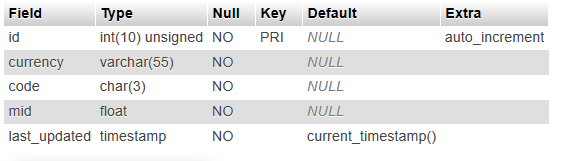
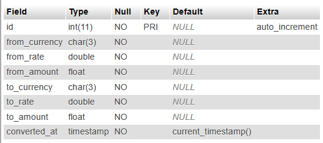

# Currency Converter
This app is a currency converter that relies on [National Bank of Poland API](http://api.nbp.pl/en.html) 

### Features 
- You can convert between currencies
- You can know the rate of a specific currency compared to Poland's currency
- You can know the latest conversions between cureencies
- This app is protected against CSRF attacks and SQL injection

### Requirements
- php 8.1 and higher

### Installation
* Just clone this repository and run this command in the terminal
```bash
 composer du
 ```
- Configure your MySQL database settings in `config/databse.php` file  

- Create the database according to your configurations
- Create two tables `exchange_rates` and `conversions`
- `exchange_rates` table


- `conversions` table



 ### Contribution guide
 Do your changes on different branch other than master then submit your pull request.
